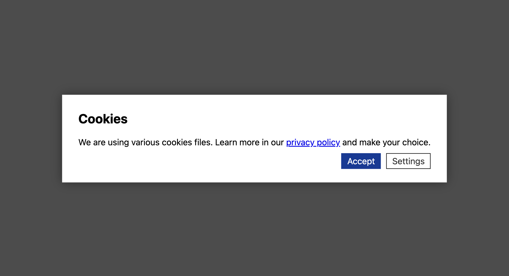

# Consent Banner JS

> <p align="center">A zero-dependency, lightweight (~1.9kB), consent platform agnostic, cookie banner for any website.</p>



## Get started

Obviously, it's easy to get started:

```html
<script src="https://public-assets.tagconcierge.com/cookies-banner-js/consent-banner.min.js"></script>
<script>
    cookiesBannerJs(
        loadConsentState,
        saveConsentState
        config
    );
</script>
```

In a nutshell you need to:

1. Load the `consent-banner.min.js` (obviously)
2. Call the global function called `cookiesBannerJs`

**INFO:** You can call the `cookiesBannerJs` function whenever, wherever you want, inside it is wrapped with DOM Ready thingy.

To make that work you need to prepare **three** things:

1. A function to load the consent state from somewhere, for instance `localStorage` (see [examples](#examples))
2. A function to do something when the user provides their consent, for instance save it in `localStorage` (see [examples](#examples))
3. A config object that contains complete configuration for the whole thing (see [examples](#examples))


## Config Object


```js
{
    display: {
        mode: 'modal|bar',
        wall: true
    },
    consent_types: [{
        name: '',
        title: '',
        description: '',
        default: 'denied|granted'
    }],
    settings: {
        title: '',
        description: '',
        buttons: {
            save: '',
            close: ''
        }
    },
    modal: {
        title: '',
        description: '',
        buttons: {
            accept: '',
            settings: ''
        }
    }
}
```

## Styling

The goal for this project was to have one, single JS file to drop "somewhere" on a page and be done with minimal consent UI.
For the sake of simplicity it does not include any defaults, no default content and no default styles except some core CSS properties to drive displaying elements.

That said it comes with few set of styles. They can be applied as CSS that you can drop like this:

`<link rel="stylesheet" type="text/css" href="https://public-assets.tagconcierge.com/cookies-banner-js/styles/light.css">`

Or we allow to apply same styles in JS using JSON config file. It accepts parameter key as CSS selector and value which is an object of CSS properties and their final values.

[light.json](./styles/light.json)

## Examples

[Bottom bar without "wall"](./examples/bar.html)

[Central modal with "wall"](./examples/modal.html)

[Some snippets for Google Tag thing](./examples/gtm.html)


## Installation

Just include the JS and optionally CSS in the page html.

There is a cool way to do it with Workers@Edge for instance CloudFlare Workers though. Check out this [example](./examples/worker.js) to see how to quickly inject on any page without touching the source code.


## Development

We like docker so that's how get local dev server:

`docker-compose up -d dev`

But first, we need to install dependencies:

`docker-compose run dev npm i`

And if we need `node` cli we get into the a shell like that:

`docker-compose run --rm dev bash`

Finally, to build minified JS file we run:

`docker-compose run dev npm run build`
